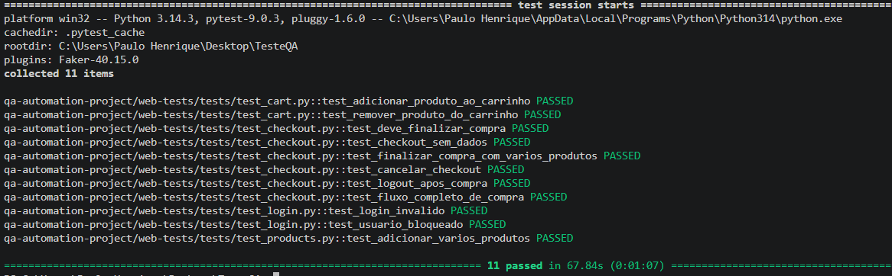
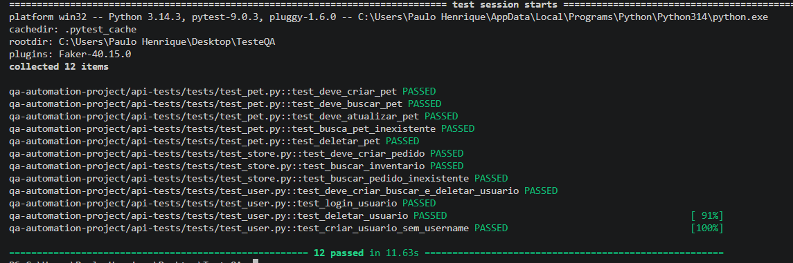

# Projeto de Automação de Testes QA

Projeto de automação de testes WEB e API utilizando Python, Selenium, Pytest e Requests.

---

# Objetivo

Automatizar testes funcionais para:

- Aplicação WEB SauceDemo
- API Swagger Petstore

O projeto foi desenvolvido utilizando boas práticas de automação, Page Objects e integração contínua com GitHub Actions.

---

# Tecnologias Utilizadas

- Python 3.11+
- Selenium WebDriver
- Pytest
- Requests
- WebDriver Manager
- ChromeDriver
- GitHub Actions

---

# Estrutura do Projeto

```bash
TESTEQA/
│
├── .github/
│   └── workflows/
│       └── ci.yml
│
├── qa-automation-project/
│
│   ├── api-tests/
│   │   ├── tests/
│   │   │   ├── test_pet.py
│   │   │   ├── test_store.py
│   │   │   └── test_user.py
│   │   │
│   │   ├── utils/
│   │   │   └── data_factory.py
│   │   │
│   │   ├── conftest.py
│   │   └── requirements.txt
│   │
│   ├── web-tests/
│   │   ├── pages/
│   │   │   ├── cart_page.py
│   │   │   ├── checkout_page.py
│   │   │   ├── login_page.py
│   │   │   └── products_page.py
│   │   │
│   │   ├── tests/
│   │   │   ├── test_cart.py
│   │   │   ├── test_checkout.py
│   │   │   ├── test_login.py
│   │   │   └── test_products.py
│   │   │
│   │   ├── conftest.py
│   │   └── requirements.txt
│   │
│   ├── .env
│   ├── .gitignore
│   └── README.md
```

---

# Funcionalidades Testadas

## Testes WEB

### Login
- Login válido
- Login inválido
- Usuário bloqueado

### Produtos
- Adicionar produto ao carrinho
- Adicionar múltiplos produtos

### Carrinho
- Remover produto do carrinho

### Checkout
- Fluxo completo de compra
- Checkout sem preenchimento dos dados

---

# Testes API

## Pet
- Criar pet
- Buscar pet existente
- Buscar pet inexistente

## Usuário
- Criar usuário
- Buscar usuário
- Deletar usuário

## Store
- Criar pedido

---

# Instalação do Projeto

## 1. Clonar o repositório

```bash
git clone https://github.com/Pauloohenri/QA.tests.git
```

---

## 2. Entrar na pasta do projeto

```bash
cd TESTEQA
```

---

# Instalação das Dependências

## WEB

```bash
cd qa-automation-project/web-tests

pip install -r requirements.txt
```

---

## API

```bash
cd ../api-tests

pip install -r requirements.txt
```

---

# Execução dos Testes

## Executar testes WEB

```bash
cd qa-automation-project/web-tests

pytest -v
```

---

## Executar testes API

```bash
cd qa-automation-project/api-tests

pytest -v
```

---

## Executar todos os testes

Na raiz do projeto:

```bash
pytest -v
```

---

# Variáveis de Ambiente

Os testes WEB utilizam variáveis de ambiente para autenticação.

---

# Pipeline CI/CD

O projeto possui integração contínua utilizando GitHub Actions.

A pipeline executa automaticamente:

- Instalação das dependências
- Execução dos testes WEB
- Execução dos testes API

Arquivo responsável:

```bash
.github/workflows/ci.yml
```

---

# Padrões Utilizados

- Page Object Model (POM)
- Fixtures do Pytest
- Esperas explícitas com Selenium
- Organização modular dos testes
- Separação entre WEB e API

---

# Evidências

## Testes WEB



---

## Testes API


# Autor

Paulo Henrique
